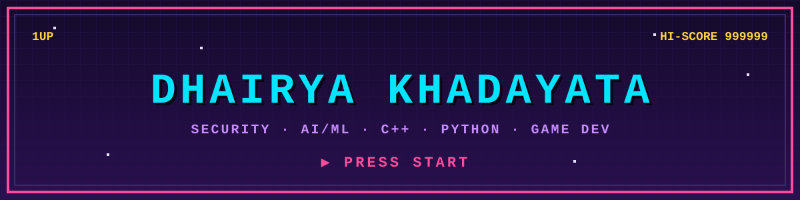

---

## 🎮 Player Stats

- 🎓 **Class:** Integrated B.Tech + M.Tech, CS (Cybersecurity) at **NFSU Delhi**
- 🧠 **Main quest:** AI/ML × Cybersecurity, working where the two meet
- 🕹️ **Origin story:** Started out dreaming of game dev, which is why this page looks like an arcade
- 🚀 **Side quest:** Spotting gaps in the tech world and building a startup to fill one
- 🎨 **Side interests:** Art, philosophy, storytelling, STEM, pop culture, sports
- 🧩 **Build:** Jack of all trades, learning fast

---

## 🧰 Inventory

  

---

## 📊 Scoreboard

---

## 🐍 Contribution Snake

<picture>
  <source media="(prefers-color-scheme: dark)" srcset="https://raw.githubusercontent.com/dhairya1official-code/dhairya1official-code/output/snake-dark.svg"/>
  
</picture>

---

## 🗺️ Quest Log

| Quest | Description | Stack |
|---|---|---|
| 🛡️ [**Kashf**](https://github.com/dhairya1official-code/Kashf-) | Agentic AI OSINT privacy dashboard (AMD Slingshot 2026): maps digital footprints, finds data leaks, automates takedowns on-device | `Python` `AI Agents` `OSINT` |
| 🚩 [**CTF-Write-Ups**](https://github.com/dhairya1official-code/CTF-Write-Ups) | Writeups from the CTFs I've played | `Security` `CTF` |
| 🚙 [**Offroad Semantic Segmentation**](https://github.com/dhairya1official-code/Offroad-Semantic-Scene-Segmentation) | Semantic scene segmentation for off-road terrain | `Python` `Computer Vision` |
| 💸 [**FairSplit**](https://github.com/dhairya1official-code/Fairsplit) | Group-expense splitter with minimal settlements and a Gemini-powered roast summary | `Python` `Streamlit` |

---

## 📡 Connect

GAME OVER? NEVER. INSERT COIN TO CONTINUE.

